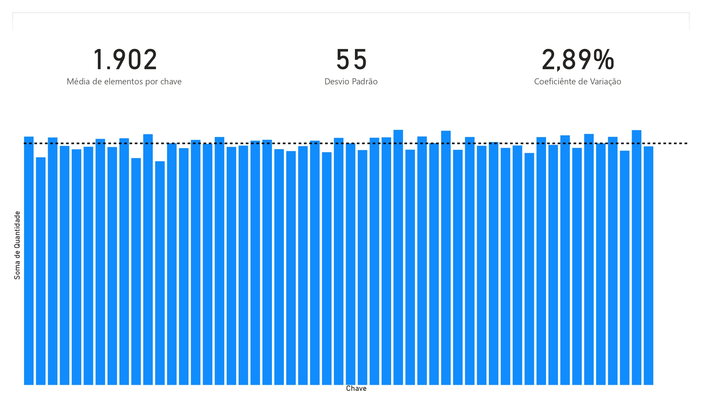

# Implementação de uma Tabela Hash

## Instruções Gerais

Este projeto consiste na implementação de uma tabela hash utilizando listas encadeadas duplas. A tabela hash permite a inserção, consulta, contagem de elementos por chave e remoção de elementos. Além disso, inclui um método de ordenação baseado no algoritmo QuickSort e utiliza a função de hash modular. A base de dados utilizada contém 100.788 nomes de brasileiros registrados no ano de 2018. A tabela hash foi construída com 53 chaves.

## Metodologia

A implementação deste projeto foi baseada nos materiais disponibilizados pelo professor, como o livro "Estruturas de Dados usando C" de Aaron M. Tenenbaum, Yedidyah Langsam e Moshe Augenstein. Também foram realizadas pesquisas adicionais na internet para aprofundar o entendimento dos conceitos envolvidos.

## Tratamento de Colisão

Nesta implementação, optou-se por utilizar listas encadeadas duplas para lidar com colisões. Essa abordagem permite que múltiplos elementos sejam armazenados em uma mesma chave, evitando a perda de dados. No entanto, em cenários onde há um limite de registros por chave, seria necessário implementar um tratamento de colisão adicional, como a sondagem linear. Essa técnica consiste em buscar o próximo slot vazio quando ocorre uma colisão, permitindo que o elemento seja inserido em uma nova posição.

### Quando Deveria Ser Implementado o Tratamento de Colisão?

O tratamento de colisão deve ser implementado quando o limite de registros em uma determinada chave é atingido. Isso ocorre quando a lista encadeada correspondente à chave está cheia e não há mais espaço para armazenar novos elementos.

### Como Poderia Ser Esta Implementação?

A implementação do tratamento de colisão pode ser feita utilizando uma estratégia de sondagem linear. Nessa abordagem, quando ocorre uma colisão, o algoritmo verifica o próximo slot vazio e insere o elemento lá. Esse processo é repetido até encontrar um slot disponível.

### Avaliação da Tabela Hash

A tabela hash gerada apresentou uma distribuição visualmente uniforme dos nomes. Em média, cada chave armazenou 1.902 nomes, com um desvio padrão de 55 nomes, representando aproximadamente 2,89% em relação à média. Esses resultados indicam que a tabela hash conseguiu distribuir os elementos de forma equilibrada entre as chaves, proporcionando um desempenho eficiente nas operações de inserção e busca.

## Análise de Frequência

A análise de frequência dos nomes na tabela hash mostrou uma distribuição aproximadamente uniforme. Isso significa que os nomes foram distribuídos de forma equilibrada entre as chaves, sem que uma chave tenha um número significativamente maior ou menor de elementos em relação às outras. Essa uniformidade contribui para a eficiência das operações de busca na tabela hash.

## Ordenação dos Elementos

A implementação do método QuickSort permitiu a ordenação dos elementos sob cada chave da tabela hash. O QuickSort é um algoritmo de ordenação eficiente e amplamente utilizado. Ao ordenar os elementos sob uma mesma chave, é possível realizar buscas mais eficientes e facilitar a recuperação dos dados em uma ordem específica.

## Distribuição dos Nomes

A distribuição dos nomes em cada uma das chaves da tabela hash pode ser visualizada no histograma abaixo:

O histograma mostra a quantidade de nomes em cada chave da tabela hash. Podemos observar que a distribuição é aproximadamente uniforme, com uma variação aceitável entre as chaves. Isso reforça a eficácia do método de hashing utilizado, pois os nomes foram distribuídos de forma equilibrada entre as chaves, evitando o acúmulo excessivo de elementos em uma única chave.

## Conclusão

Este projeto demonstrou a implementação de uma tabela hash utilizando listas encadeadas duplas. A tabela hash proporcionou a inserção, consulta, contagem de elementos por chave e remoção eficientes. Além disso, a utilização do método QuickSort permitiu a ordenação dos elementos sob cada chave, facilitando as operações de busca. A análise da distribuição dos nomes evidenciou a uniformidade da tabela hash, com uma distribuição equilibrada entre as chaves. Isso demonstra que a função de hash utilizada foi capaz de distribuir os elementos de forma adequada.

Em suma, este projeto atingiu os objetivos propostos e demonstrou a utilidade das estruturas de dados estudadas. A implementação da tabela hash com listas encadeadas duplas mostrou-se eficiente e versátil, podendo ser aplicada em diversas situações onde é necessário armazenar e recuperar dados de forma rápida e organizada.

---

Este projeto foi desenvolvido por Thales Ferreira para o Trabalho final da disciplian de Estrutura de Dados. Para mais detalhes, consulte o código-fonte no [Trabalho Final](https://github.com/thalesfb/ED-I/tree/main/Trabalho%20Final).
